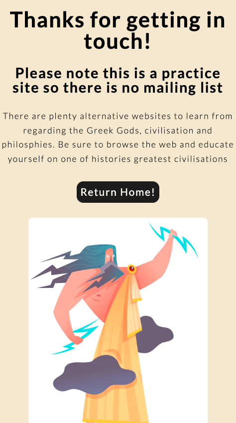

# Greek Gods Galore

(Developer: Darrach Barneveld)

[Greek Gods Galore Live Page](https://darrachbarneveld.github.io/Project-1-Code-Institute/)

Greek Gods Galore is an informative online resource that delves into the mythologies surrounding the 12 Greek gods who resided atop Mount Olympus. The site provides detailed accounts of each deity's characteristics, symbols, and legends, allowing readers to gain a deeper understanding of the ancient pantheon. This is a mock site and as such features a mailing list that is not currently active. The site was built by myself, an enthusiast of classical civilisation and mythic lore. It is a passion project as well as a project for the Code Institute's assessment.

## Table of Contents

1. [Project Goals](#project-goals)
   1. [Business Goals](#business-goals)
   2. [User Goals](#user-goals)
2. [UX](#UX)
   1. [Target Audience](#target-audience)
   2. [User Requirements and Expectations](#user-requirements-and-expectations)
   3. [User Stories](#user-stories)
3. [Design](#design)
   1. [Design Choices](#design-choices)
   2. [Colours](#colours)
   3. [Fonts](#fonts)
   4. [Structure](#structure)
   5. [Wireframes](#wireframes)
4. [Technologies Used](#technologies-used)
   1. [Languages](#languages)
   2. [Frameworks & Tools](#frameworks--tools)
5. [Features](#features)
   1. [Current Features](#current-features)
   2. [Potential Features](#potential-features)
6. [Testing](#testing)
   1. [HTML Validation](#HTML-validation)
   2. [CSS Validation](#CSS-validation)
   3. [Accessibility](#accessibility)
   4. [Performance](#performance)
   5. [Device testing](#device-testing)
   6. [Browser compatibility](#browser-compatability)
   7. [Testing user stories](#testing-user-stories)
7. [Bugs](#Bugs)
8. [Deployment](#deployment)
9. [Credits](#credits)
10. [Acknowledgements](#acknowledgements)

## Project Goals

The construction of Greek Gods Galore website and brand was done for a key purpose. To create a community of educated individuals who shared a passion for all things Graeco.

### Business Goals

- Build brand authority in the niche of Greek mythology
- Educate and inform visitors about the 12 Greek gods and their significance in mythology
- Build a community around the website, connecting with enthusiasts of Greek mythology
- Create engaging and shareable content that attracts and retains visitors

### User Goals

- Learn about the history and mythology of the 12 Greek gods
- Understand the characteristics, powers, and relationships of each god
- Explore stories and myths associated with the 12 Greek gods
- Engage with other enthusiasts of Greek mythology and exchange ideas and perspectives
- Subscribe to a mailing list filled with content from scholars and researchers.

[Back to Table of Contents](#table-of-contents)

## UX

### Target Audience

- Enthusiasts of Greek mythology, history, and culture
- Students and scholars of ancient Greek history and literature
- Educators and teachers looking for resources to teach Greek mythology to their students

### User Requirements and Expectations

- Accurate and reliable information presented in an accessible and engaging manner
- Clear organization and navigation that allows users to easily find the information they are looking for
- Mobile-friendly design that allows users to access the website from any device
- Regular updates and new content to keep the website fresh and relevant
- High-quality images and artwork depicting the 12 Greek gods and their stories
- Accessibility features, such as alternative text for images and keyboard navigation, for users with disabilities

### User Stories

#### Website/Business Owner:

1. I want to create a comprehensive and authoritative resource on the 12 Greek gods, to establish my brand as a trusted source in the niche of Greek mythology.
2. I want to attract a large and engaged audience, to increase website traffic and generate revenue through advertising, sponsorships, or affiliate marketing.
3. I want to create high-quality content that is easily shareable, to increase brand awareness and attract new visitors to the website.
4. I want to establish a strong community of enthusiasts of Greek mythology, to create a loyal and engaged audience that supports the growth and sustainability of the website.
5. I want to continuously improve the website design, functionality, and content, to meet the evolving needs and expectations of my audience and stay ahead of the competition.
6. I want to collaborate with other websites or influencers in the niche of Greek mythology, to increase the online presence and visibility of my brand and attract new visitors to the website.

#### New Users:

1. I want to find a website that provides comprehensive and accessible information about the 12 Greek gods, so that I can learn about their stories, significance, and cultural impact.
2. I want the website to have engaging and visually appealing content, such as high-quality images, interactive features, and compelling narratives, so that I can be inspired and entertained while learning.
3. I want the website to offer additional resources, such as recommended books, articles, or videos, so that I can continue my learning and exploration beyond the website.

#### Existing Users:

12. I want the website to have a sense of community and social connection, with opportunities to interact with other enthusiasts, such as through social media, live events, or virtual discussions, so that I can feel part of a larger and supportive group.
13. I want the website to provide exclusive or premium content via a mailing-list, such as behind-the-scenes interviews, expert analysis, or early access to new articles, so that I can feel valued and rewarded for my loyalty and engagement.
14. I want the website to respond to my feedback and suggestions, either through direct communication or through regular updates and improvements, so that I can feel heard and involved in the evolution of the website.
15. I want to find new and regularly updated content about the 12 Greek gods, so that I can deepen my knowledge and continue to be engaged and entertained by the website.

[Back to Table of Contents](#table-of-contents)

## Design

### Design Choices

To design this website, I conducted research on other websites that provide information about the 12 Greek gods. I explored different layouts, font styles, and color schemes to determine what would best appeal to our target audience. Ultimately I chose a simple single page layout to enhance navigation and a sticky header. This proved the most responsively friendly design.

Some websites visited for reference are:

1. [Theoi](https://www.theoi.com/)
2. [Greek Mythology](https://www.greekmythology.com/)
3. [Greek Gods and Goddesses](https://greekgodsandgoddesses.net/)

### Colours

Using other websites as a reference as well as the inspiration of ancient statues, ruins and artefacts I went for a nude colour scheme. [Venngage's Accessible color palette generator](https://venngage.com/tools/accessible-color-palette-generator).

Primary Colours - #f2e9cc / #ffffff / #dac6b7

Secondary Colours - #1c1c1c / #fffaf0

All colours were checker using [Accessible Webs Contrast Checker](https://accessibleweb.com/color-contrast-checker/). This ensured the page was compliant to WCAG AAA standards.

### Fonts

All fonts used were sourced and imported from [Google Fonts](https://fonts.google.com/) library.

The main text font used was Lato with a sans-serif fallback. The lightweight Lato was a design choice to offset the bolder titles. All headings and sub-headings were initially designed with Castoro Titling but was later switched to Quattrocento as it featured a bold style.

### Structure

The structure of the page follows a basic an easy to follow flow. The design choice to remain on a single page meant the user could follow a journey as they scrolled through the page. The content was split into 5 distinct sections.

1. Header/Navigation
2. Hero Section
3. Introduction Section
4. Gods Section
5. Subscribe & More Info Section.
6. Footer

There was also two futher supplementary sections to provide a more well rounded experience. A 404 page was designed to route all traffic that visited a broken link back to the homepage and a success section for when the user filled out the subscription form.

#### Header Section

1. Text Logo featured on the left of the header.
2. Navigation items to the left hand side.
3. Sticky header that allows the users to easily navigate the website even when scrolling.

#### Hero Section

1. Large background image with engaging and descriptive title.
2. Animated image of a renaissance painting of the 12 Greek Gods.

#### Introduction / History Section

1. Paragraph describing the Gods.
2. Informative embedded video sourced from [The Life Guide](https://www.youtube.com/watch?v=Ri-AoKE42rw).
3. Paragraph on Mount Olympus.
4. Embedded Google Maps showing Mount Olympus on the map.

#### Gods Section

1. Cards with images of the 12 Greek Olypmic Gods.
2. Cards link to each section of the page that describes them in more detail.
3. Description of the gods.

#### Subscription Section

1. Form for subscribing to the mailing list.
2. Mock Articles showcasing the content received via subscription.

#### Footer Section

1. Greek Gods Galore Logo
2. Social Icons
3. Email contact of the website founder/creator.

### Wireframes

### Index

Mobile

iPad/Medium Screen

Desktop

### Success

Mobile

iPad/Medium Screen

Desktop

### 404

Mobile

iPad/Medium Screen

Desktop

[Back to Table of Contents](#table-of-contents)

[Back to Table of Contents](#table-of-contents)

## Technologies Used

### Languages

- HTML
- CSS

### Frameworks & Tools

- [Git](https://git-scm.com/)
- [GitHub](https://github.com/)
- [VS Code](https://code.visualstudio.com/)
- [Gitpod - Cloud IDE](https://www.gitpod.io/)
- [Balsamiq - Wireframe](https://balsamiq.com/wireframes/)
- [Google Fonts](https://fonts.google.com/)
- [Font Awesome](https://fontawesome.com/)
- [Favicon.io - favicon generator](https://favicon.io/)
- [Google Maps](https://www.google.com/maps)
- [Youtube](https://youtube.com/)
- [Photopea](https://www.photopea.com/)
- [Google Lighthouse](https://developer.chrome.com/docs/lighthouse/overview/)
- [W3C Markup Validation Service](https://validator.w3.org/)
- [W3C CSS Validation Service](https://jigsaw.w3.org/css-validator/)
- [Google Lighthouse](https://developer.chrome.com/docs/lighthouse/overview/)

[Back to Table of Contents](#table-of-contents)

## Features

### Current Features

### Logo and Navigation Bar

- Main header for all pages.
- Logo and navigation links which bring user to different page sections.
- Sticky header to make navigation easy throughout the user journey.

#### Desktop & Larger Screens

#### Tablet, Mobile and Smaller Screens

### Hero Section

- Displays a large and high quality image as a background to set the tone of ancient greece.
- Large, descriptive and engaging headline immediately intrigue user curiosity and inform them of the sites content.
- Animated image of a renaissance painting of the 12 Greek Gods. Draws the attention through motion.

#### Desktop & Larger Screens

#### Tablet, Mobile and Smaller Screens

### History Section

#### Desktop & Larger Screens

#### Video Area

- Short paragraph to describe who were the greek gods.
- Quote from Aristotle
- Embedded youtube video to give an indepth analysis of the gods

#### Tablet, Mobile and Smaller Screens

#### Map Area

- Short paragraph on where the gods lived
- Embedded Google maps on location of Mouth Olympus

#### Tablet, Mobile and Smaller Screens

### Gods Section

#### Card Area

- 12 cards with an artist rendition of the 12 greek gods
- Links to more information on each god

#### Desktop & Larger Screens

#### Tablet, Mobile and Smaller Screens

#### Description Area

- 12 cards with the name of each god and their role
- Short description about each god

#### Desktop & Larger Screens

#### Tablet, Mobile and Smaller Screens

### Contact Section

- A subscription form that allows users to sign up to a mailing service.
- Different rates based on frequency of mail
- Showcasing 3 articles that represent the content delievered.
- Each article links to external sites

#### Desktop & Larger Screens

#### Tablet, Mobile and Smaller Screens

### Footer

- Main footer for all pages.
- Logo and contact information
- Social icons for the webpage
- Email contact form

#### Desktop & Larger Screens

#### Tablet, Mobile and Smaller Screens

### Success Page

- Upon submission of the mailing list subscription a user is brought to this page
- Shows the user that their subscription was successful.
- Describes to the user that the site is a mock site and has a navigation back to home page button.
- Consistant header and footer from main index page.

#### Desktop & Larger Screens

#### Tablet, Mobile and Smaller Screens

### 404 Page

- 404 page that shows when any non dedicated link is visited
- Has a navigation button back to home page and tell the user that the page does not exist.
- Consistant header and footer from main index page.

#### Desktop & Larger Screens

#### Tablet, Mobile and Smaller Screens

### Potential Features

The following features could be implemented in the future but are beyond the scope of this project.

- User subscription and account creation features that allow users to create a personal profile, save their favorite articles or quizzes, receive personalized recommendations and updates.
- Interactive quizzes or games related to Greek mythology, such as personality tests to determine which Greek god or goddess you are most like.
- A forum or blog that hosts user-generated content, such as fan art, fan fiction, or reviews of books or movies inspired by Greek mythology, to foster a sense of community and engagement among users.

[Back to Table of Contents](#table-of-contents)

## Testing

### HTML Validation

Validator W3 was used to validate the HTML of the website. All pages pass with no errors and no warnings shown.

- index.html [results](https://validator.w3.org/nu/?doc=https%3A%2F%2Fdarrachbarneveld.github.io%2FProject-1-Code-Institute%2F)
- success.html [results](https://validator.w3.org/nu/?doc=https%3A%2F%2Fdarrachbarneveld.github.io%2FProject-1-Code-Institute%2Fsuccess)
- 404.html results [results](https://validator.w3.org/nu/?doc=https%3A%2F%2Fdarrachbarneveld.github.io%2FProject-1-Code-Institute%2F404)

### CSS Validation

The W3C Jigsaw CSS Validation Service was used to validate the CSS of the website.

- styles.css [results](https://jigsaw.w3.org/css-validator/validator?uri=https%3A%2F%2Fdarrachbarneveld.github.io%2FProject-1-Code-Institute%2F&profile=css3svg&usermedium=all&warning=1&vextwarning=&lang=en)

### Accessibility

The WAVE WebAIM web accessibility evaluation tool was used to ensure the website met high accessibility standards. All pages pass with 0 errors.

- index.html [results](https://wave.webaim.org/report#/https://darrachbarneveld.github.io/Project-1-Code-Institute/)
- success.html [results](https://wave.webaim.org/report#/https://darrachbarneveld.github.io/Project-1-Code-Institute/success)
- 404.html results [results](https://wave.webaim.org/report#/https://darrachbarneveld.github.io/Project-1-Code-Institute/404)

### Performance

Google Lighthouse in Google's Chrome Developer Tools was used to test the performance of the website. All elements performed well.

### Index

Desktop

Mobile

### Success

Desktop

Mobile

### 404

Desktop

Mobile

### Device testing

The website was tested on the following devices:

#### Local

- MacBook Pro 2020
- Huawei P30

#### Cloud

- Tested using Google Chromes Developer Tools to simulate all devices
- IPhone 10 - XCode simulator.

### Browser compatibility

The website was tested on the following browsers:

- Google Chrome 113.0.5672.63
- Mozilla Firefox 109.0
- Safari 13 Ventura

### Testing user stories

#### Website/Business Owner

- I want to test the site's usability and navigation, to ensure that users can easily find the information they need and navigate between pages.

  1. User can navigate to any section by using the sticky header navigation.
  2. User can navigate to any god description by clicking on the god card.

- I want to test the site's performance and loading speed, to ensure that it can handle a high volume of traffic and provide a smooth user experience.

  1. Site passing all performance testing metrics.

- I want to test the site's accessibility and compatibility, to ensure that it can be accessed on different devices and browsers, and that users with disabilities or special needs can use it effectively.

  1. Site is fully responsive across all platforms.
  2. Site is usable across all different browsers.
  3. Site passes all testing for accessibility.

- I want users to be able to contact me directly and sign up to subscription services.

  1. Contact email for works as well as direct linking to social platforms.
  2. Subscrition form works and shows users a success page.

- I want to make sure users are directed back to the index page of the website and not rely on the browser navigation to return to home page.
  1. 404 page instructs the user the page doesn't exist and directs them back to the home page with a navigation button on the both header and below 404 text.

#### New Users:

- I want to immediately understand the content of the site so I can make a quick decision as to whether or not to continue.

  1. Hero text clearly states the purpose of the website
  2. First heading reinforces the context of the website.

- I want to be able to quickly navigate to desired areas of the website and find the information displayed clearly and concisely.

  1. Sticky navigation shows the key areas of the website.
  2. Clear and consise paragraphs outline the important points of each god. The who, what and where are all covered.

- I want to have multiple media sources displayed on the website I can get a comprehensive outlook on the information I require

  1. Youtube video media embedding an informative video
  2. Links to articles describing information in more detail
  3. High quality images and artist renditions of the mythical gods
  4. Map embedded to show location of the source material

#### Existing Users:

- I want to be able to sign up to a mailing list the website so as to get alerts about future content.

  1. Mailing list form at the end of the page allows users to input their details.
  2. Choice of subscription gives the user control of the frequency of articles delivered.
  3. Success page is routed to upon completion of the form giving user feedback.

- I want to locate contact details of the websites owner so as to website so I can request assistance.

  1. Contact details located on the footer of the page show both the email, address, name and socials of the owner.

- I want to locate contact details of the websites owner so as to website so I can request assistance.
  1. Contact details located on the footer of the page show both the email, address, name and socials of the owner.

[Back to Table of Contents](#table-of-contents)

## Bugs

| **Bug**                                                                                                                                                       | **Fix**                                                                                                                                                                                                |
| ------------------------------------------------------------------------------------------------------------------------------------------------------------- | ------------------------------------------------------------------------------------------------------------------------------------------------------------------------------------------------------ |
| Due to the hero image animation using CSS background url the image was unable to be optimised. This lead to high load times and poor performance.             | Using CSS media queries the hero image was disabled on mobile devices leading to better performance and lighthouse scores.                                                                             |
| Embedding youtube videos and lead to large delays in performance. Reduce unused JavaScript, Javascript execution times and serving static assest were issues. | Following the tutorial on [Vumbnail](https://vumbnail.com/examples/srcdoc-iframe-for-lighthouse) I was able to drastically reduce performance issues by following the instructional srcdoc html setup. |
| Embedding Google Maps meant the certain errors were not able to be resolved. These were serving static assests with an efficient cashe policy.                | Unfortunately no reasonable solution was found and this is a common error when embedding google maps. Without use of custom Javascript code which is beyond the scope of this project.                 |

[Back to Table of Contents](#table-of-contents)

## Deployment

The website was deployed using GitHub Pages:

1. In the GitHub repository navigate to the Settings tab
2. On the left-hand menu select Pages
3. For the source select Branch: master
4. After the webpage refreshes automatically you will see a ribbon on the top saying: Your site is live at https://darrachbarneveld.github.io/Project-1-Code-Institute/

You can for fork the repository:

1. Go to the GitHub repository
2. Click on Fork button in the upper right-hand corner
3. Edit the repository name and description if desired
4. Click the green create fork button

You can clone the repository:

1. Go to the GitHub repository
2. Locate the green Code button above the list of files and click it
3. Select if you prefer to clone using HTTPS, SSH, or Github CLI and click the copy button to copy the URL to your clipboard
4. Open Git Bash
5. Change the current working directory to the one where you want the cloned directory
6. Type git clone and paste the URL from the clipboard ($ git clone https://github.com/YOUR-USERNAME/YOUR-REPOSITORY)
7. Press Enter to create your local clone.

You can run this repository locally:

1. Go to the GitHub repository
2. Locate the green Code button above the list of files and click it
3. From the dropdown menu select download Zip.
4. Download and open the zip file to run in an editor

[Back to Table of Contents](#table-of-contents)

## Credits

### Images

- [Hero Background](https://wallpaperaccess.com/greece-ruins) by [Wallpaper Access](https://wallpaperaccess.com/greece-ruins)
    

Hero Background

    
    

- [Hero Image](https://commons.wikimedia.org/wiki/File:La_dispute_de_Neptune_et_Ath%C3%A9na.jpg) by [Jacob Jordaens Wikimedia](https://commons.wikimedia.org/wiki/File:La_dispute_de_Neptune_et_Ath%C3%A9na.jpg)
  

Hero Image

  
  

- [Gods](https://www.freepik.com/free-vector/ancient-greece-gods-cartoon-set_6207098.htm#query=greek%20gods&position=1&from_view=keyword&track=ais) by [Macrovector at Freepik](https://www.freepik.com/free-vector/ancient-greece-gods-cartoon-set_6207098.htm#query=greek%20gods&position=1&from_view=keyword&track=ais)
  

Hero Image

  
  

- [Hercules](https://wandervirtually.com/the-story-of-hercules/) by [Wander Virtually](https://wandervirtually.com/the-story-of-hercules/)
  

Hero Image

  
  

### Video

- [Greek Gods Explained in 12 Minutes](https://www.youtube.com/watch?v=Ri-AoKE42rw&embeds_euri=http%3A%2F%2F127.0.0.1%3A5500%2F&source_ve_path=MjM4NTE&feature=emb_title) by [The Life Guide](https://www.youtube.com/watch?v=Ri-AoKE42rw&embeds_euri=http%3A%2F%2F127.0.0.1%3A5500%2F&source_ve_path=MjM4NTE&feature=emb_title)

### Map

- [Google Maps](https://www.google.com/maps)

- [Back to Table of Contents](#table-of-contents)

### Code

- Starter template was the [Code Institute student template](https://github.com/Code-Institute-Org/gitpod-full-template)
- Hero image animation was inspired by [Hyperplexed](https://www.youtube.com/watch?v=jMVhxBB3l0w&t=9s)
- Embedded Youtube performance code was reconstructed from [Vumbnail](https://vumbnail.com/examples/srcdoc-iframe-for-lighthouse)
- Embedding Google Maps code was reconstructed from [Google Maps Platform](https://developers.google.com/maps/documentation/embed/get-started)
- CSS fixing of sticky header height was reconstructed from [Go make things](https://gomakethings.com/how-to-prevent-anchor-links-from-scrolling-behind-a-sticky-header-with-one-line-of-css/)
- ReadMe Layout and guide heavily inspired by [Mat Shephard](https://github.com/mat-shepherd/ci-pp1-nurture-seo#target-audience)
- CSS root variables from [MDN](https://developer.mozilla.org/en-US/docs/Web/CSS/:root)
- Breakpoint templated used from [Gokulkrishh](https://gist.github.com/gokulkrishh/242e68d1ee94ad05f488)

## Acknowledgements

I would like to make the following thanks to all that helped me on this project:

- My mentor Adegbenga Adeye for your clear and consise instruction. Showing me tools, guidance and finding errors in my projects
- Alan Bushelland the April 2023 Student Cohort for their knowledge sharing, advice, and camaraderie during our weekly standup calls and in Slack
- Fellow Students Alice Hillier, Emilia Dombek, Shane_Donlon, Tanguy L'Alexandre, Vitor Barbosa, Alan Yeates and Kurt McGoona for their constructive feedback

[Back to Table of Contents](#table-of-contents)
